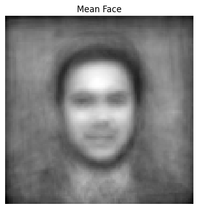

# The Typical Look Within a Group  
### Statistical Face Modeling Using PCA

<p align="center">
  
  <br>
  <em>Mean face computed using PCA from the image dataset.</em>
</p>

---

## Overview

This project applies **Principal Component Analysis (PCA)** to model and visualize the *typical look* within a collection of human faces.  
Using concepts from **computational linear algebra**, the project computes the statistical average of facial images (the *mean face*) and identifies the main directions of variation (the *eigenfaces*).  

The goal is to show how high-dimensional image data can be represented efficiently and meaningfully using a small number of orthogonal components.

---

> ⚠️ **IMPORTANT NOTE**  
> The visual quality of the computed **mean face** depends heavily on the **number and consistency of input images**.  
> With more images, the average becomes smoother, clearer, and more representative of the group.  
>  
> In this case, the results are based on a **small dataset** due to the practical limitations of running the computation on a **personal laptop**.  
> Therefore, some artifacts and roughness appear in the mean face and eigenfaces — a natural consequence of limited data, not of the method itself.

---

## Motivation

Faces are high-dimensional data objects, but most of their variation can be explained by a few dominant patterns.  
PCA provides a mathematical way to capture those patterns and reconstruct new or average representations.  

In this project, PCA is used to:
- Estimate the **average appearance** within a defined group of faces.  
- Visualize the **principal components** that define major variations.  
- Reconstruct images using only a limited number of eigenfaces.  

---

## Method

1. **Preprocessing**  
   - Convert images to grayscale and resize them to a fixed resolution.  
   - Flatten each image into a vector and assemble them into a data matrix \( X \).

2. **Mean Face and Centering**  
   - Compute the mean image vector \( \mu \).  
   - Subtract \( \mu \) from each image to center the data.

3. **PCA Computation**  
   - Apply Singular Value Decomposition (SVD):  
     \[
     X = U \Sigma V^T
     \]
   - Columns of \( V \) correspond to eigenfaces.

4. **Reconstruction**  
   - Each image is approximated as a linear combination of the mean face and a few top eigenfaces.

---

## Results

- The **mean face** represents the statistical center of the dataset.  
- **Eigenfaces** capture interpretable modes of variation such as lighting, expression, and pose.  
- Using only a subset of eigenfaces, the reconstruction maintains a visually recognizable identity while dramatically reducing dimensionality.  
- With more input images, both the mean and eigenfaces become clearer and more stable.

All results are stored in the `results/` folder:
```
results/
├── mean_face.png
├── eigenfaces/
└── reconstructions/
```

---

## How to Run

```bash
git clone https://github.com/BitwodedSeleshiDemissie/The-Typical-Look-Within-a-Group-Statistical-Face-Modeling-Using-PCA.git
cd The-Typical-Look-Within-a-Group-Statistical-Face-Modeling-Using-PCA

python3 -m venv venv
source venv/bin/activate
pip install -r requirements.txt
python3 main.py
```

Place your dataset in `data/raw/`.  
Each subfolder should contain the images of one person or one group.

---

## Applications

- **Dimensionality reduction** for high-dimensional image data.  
- **Face recognition and clustering** using PCA features.  
- **Statistical visualization** of group-level patterns.  
- **Educational tool** for understanding linear algebra concepts like SVD and eigen-decomposition.

---

## Ethical Note

This project uses publicly available datasets and treats images as numerical data for mathematical modeling.  
It does not attempt to classify or interpret identity, ethnicity, or cultural traits.  
All results are purely statistical and illustrative.

---

## Keywords
PCA · Linear Algebra · Eigenfaces · Dimensionality Reduction · Image Analysis · Data Science
